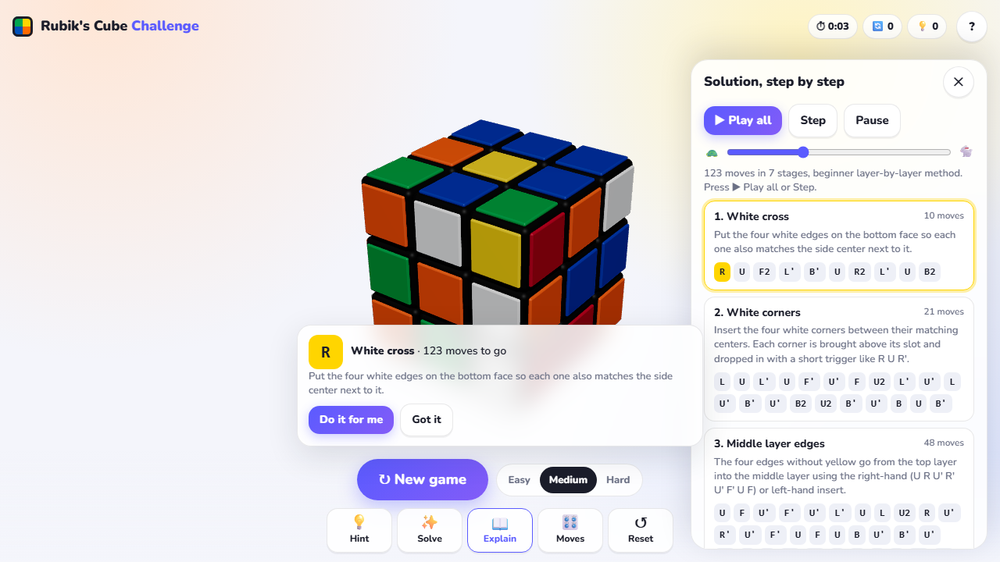

# 3D Rubik's Cube Challenge

[](https://github.com/OutOfAmine/3D-Rubik-s-Cube-web-application/actions/workflows/deploy.yml)
[](https://outofamine.github.io/3D-Rubik-s-Cube-web-application/)
[](https://github.com/OutOfAmine/3D-Rubik-s-Cube-web-application/stargazers)
[](https://github.com/OutOfAmine/3D-Rubik-s-Cube-web-application/network/members)
[](https://github.com/OutOfAmine/3D-Rubik-s-Cube-web-application/commits/main)
[](https://github.com/OutOfAmine/3D-Rubik-s-Cube-web-application)
[](LICENSE)


Play a 3D Rubik's Cube in your browser. One tap scrambles it, then solve it by hand with drag controls, ask for a hint, or watch a layer-by-layer solution explained stage by stage. Free, no install, works on phone and desktop.

**▶ Play now:** https://outofamine.github.io/3D-Rubik-s-Cube-web-application/

[](https://outofamine.github.io/3D-Rubik-s-Cube-web-application/)

## Features

- One tap to play: pick Easy / Medium / Hard, hit **Play**, the cube scrambles and the timer starts.
- Realistic 3×3×3 cube rendered with Three.js: rounded stickers, plastic sheen, soft shadows, orbit camera, idle spin.
- Turn layers by dragging a sticker or from the **Moves** drawer (Singmaster notation `U D L R F B`, `'`, `2`).
- **Hint** shows the next move and the current stage of the beginner method, with a "Do it for me" button.
- **Solve** plays the whole solution; **Explain** lists it in 7 stages (white cross, white corners, middle edges, yellow cross, yellow face, corner permutation, edge permutation) with Play all / Step / Pause and a speed slider.
- Win screen with time, moves, hints, confetti and a share button (Web Share API, clipboard fallback).
- Mobile-first layout: thumb-zone action bar, bottom sheet on phones, side panel on desktop, safe-area aware.

## Run locally

The app is plain ES modules loaded through an import map, so any static server works:

```bash
npm start          # http://localhost:8080
# or
python -m http.server 8080
```

Opening `index.html` directly from disk does not work: browsers block ES modules on `file://`.

## Test

```bash
npm test
```

Runs the solver test-suite with Node's built-in test runner (`node:test`), including 100 random scrambles that must solve. `index.html?test` runs the same self-check in the browser console.

## Project layout

```
index.html               markup, import map
src/styles.css           styles
src/cube-logic.js        cube model + solver, pure (no DOM, no Three.js)
src/main.js              Three.js scene, animation pipeline, input, UI
test/cube-logic.test.js  node:test suite
.github/workflows/       test on every push and PR, deploy to GitHub Pages from main
```

## How it works

- **State**: 26 cubies, each with a grid position in `{-1,0,1}³` and stickers holding their current outward normal and home face. A move rotates the positions and normals of the 9 cubies in one layer by 90°.
- **Animation**: the 9 meshes are attached to a pivot group at the origin, the pivot angle is eased from 0 to ±π/2 with `requestAnimationFrame`, then the meshes are re-parented to the cube group and their positions and quaternions are snapped to exact grid values.
- **Solver**: layer-by-layer. Each stage is a small iterative-deepening search over a menu of standard algorithms (triggers, Sune, A-perm, U-perm) with a goal predicate, so the solver is compact and self-verifying. Solutions average about 115 moves.

## Deploy

Pushing to `main` runs the tests and publishes the site to GitHub Pages through GitHub Actions. The repository's Pages source must be set to "GitHub Actions".

## Contributing

`main` is protected: every change goes through a pull request, needs the test workflow to pass and a review from the maintainer. Dependabot opens PRs for GitHub Actions updates weekly.

```bash
git checkout -b my-change
npm test
git push -u origin my-change   # then open a PR
```

## License

MIT
